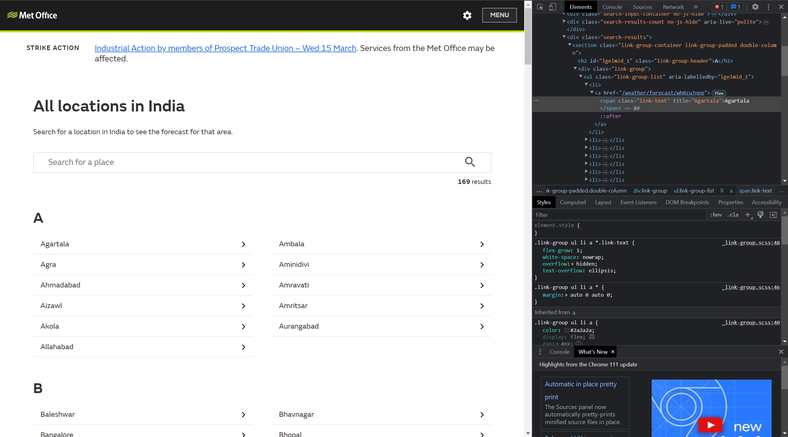

# Python Web Scraper

For Homework 4 (Week 6), I made a Python web scraper that scrapes the Highest Daily Temperature data from the Met Office UK website for major Indian cities and then plots it using matplotlib and exports it into a CSV document. The webscraper finds all the links to major Indian cities and states from the page and then parses the HTML file to retrieve the necessary date from  tags.    
   
Note: The explanation for all the steps is in the Jupyter Notebook attached. 
Note: I used Joe James' tutuorial as reference for this homework. Link [here](https://www.youtube.com/watch?v=zD0FDYI5_rs).     
Note: The exported CSV file is attached in the Repo.   

I explored the following modules for this homework:
- requests
- beautiful soup
- numpy
- matplotlib
- csv

Gallery:
Link to homepage with all States and major Indian cities: https://www.metoffice.gov.uk/weather/world/india/list    
Link to example single page: https://www.metoffice.gov.uk/weather/forecast/wh0zu7npp#?date=2023-03-14

    
 Homepage with all links in this format

    
 Example page with high temperatures in  \ tags
